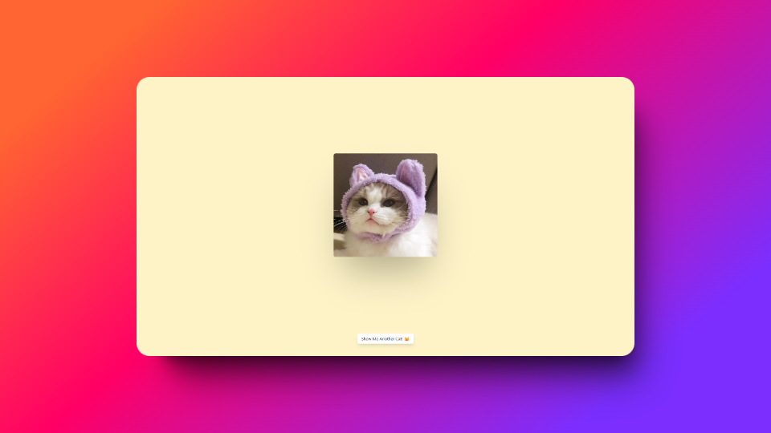

<a name="readme-top"></a>
<!-- PROJECT LOGO -->
<br />
<div align="center">
  <a href="https://github.com/Ximuelo/random-cat-picture">
    
    <!-- Get img from svg in public/favicon.svg -->
    
  </a>

<h3 align="center">Random Cat Picture</h3>

  <p align="center">
    A web that displays a random cat picture
    <br />
    <a href="https://epic-free-games-page.vercel.app/">View Page</a>
  </p>
</div>

<!-- ABOUT THE PROJECT -->
## About The Project
 
 <p align="center">Cover made with <a>shots.so</a></p>

### Built With

* [![Astro][Astro.build]][Astro-url]
* [![TypeScript][TypeScript]][TypeScript-url]
* [![TailwindCSS][TailwindCSS]][TailwindCSS-url]

<p align="right">(<a href="#readme-top">back to top</a>)</p>


<!-- GETTING STARTED -->
## Getting Started

### Installation

1. Clone the repo
   ```sh
   git clone https://github.com/Ximuelo/random-cat-picture.git
   ```
3. Install NPM packages
   ```sh
   npm install
   ```
4. Start the project as a development server
   ```js
   npm run dev
   ```
Open http://localhost:3000 with your browser to see the result.


<!-- MARKDOWN LINKS & IMAGES -->
[Astro.build]: https://img.shields.io/badge/Astro-BC52EE?logo=astro&logoColor=fff&style=for-the-badge
[Astro-url]: https://astro.build/
[TypeScript]: https://img.shields.io/badge/typescript-blue?style=for-the-badge&logo=typescript&logoColor=white
[TypeScript-url]: https://www.typescriptlang.org/
[TailwindCSS]: https://img.shields.io/badge/tailwind_css-blueviolet?style=for-the-badge&logo=tailwindcss&logoColor=white
[TailwindCSS-url]: https://tailwindcss.com/